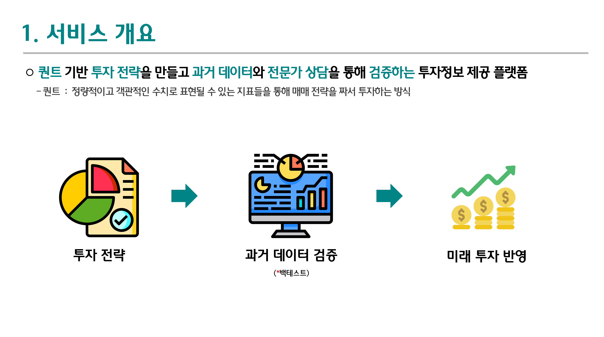
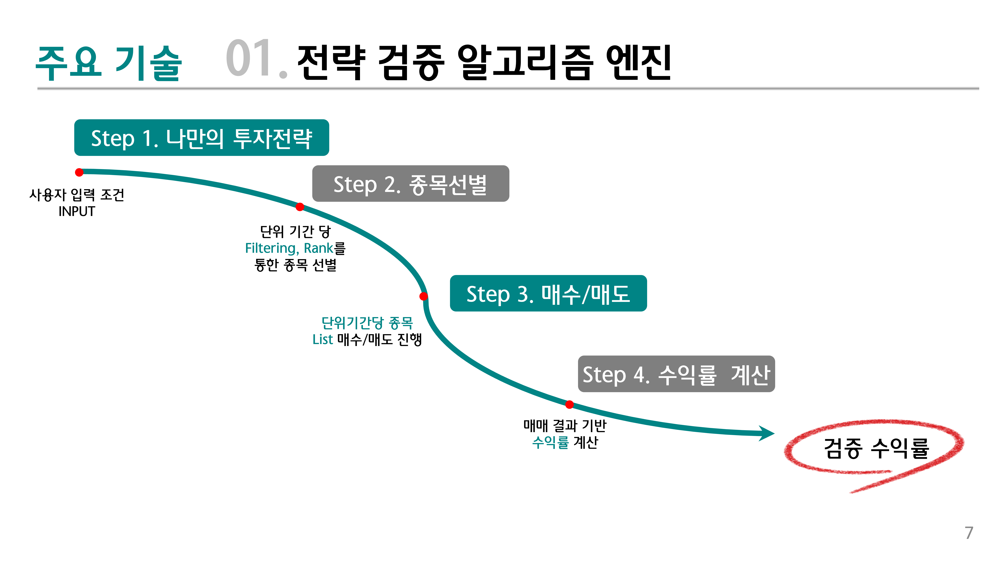
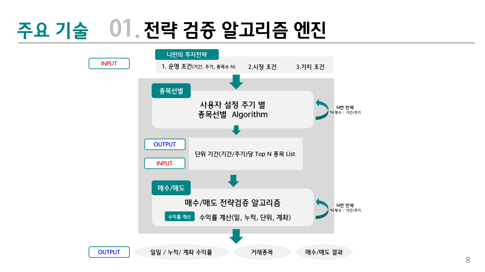
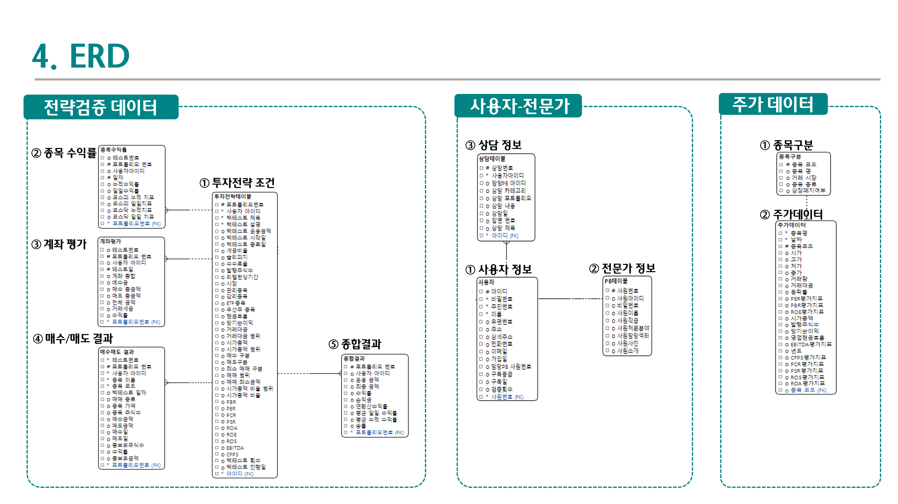
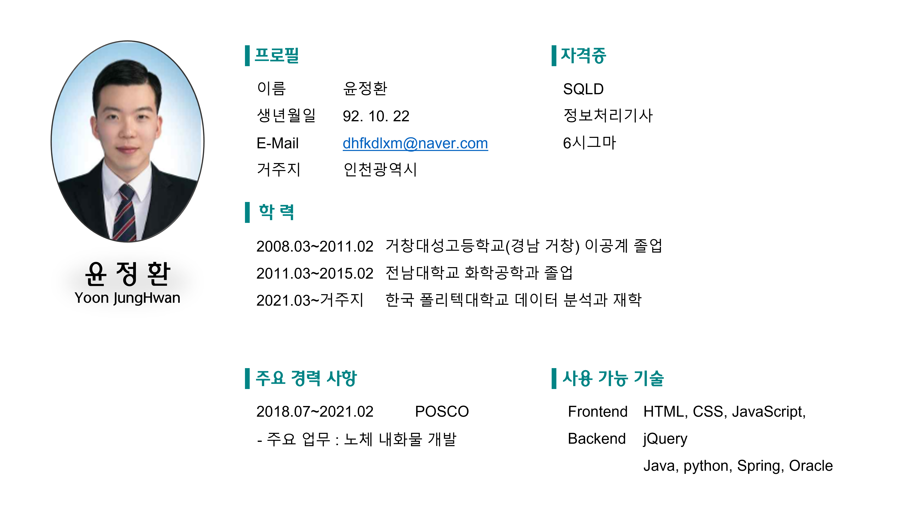

# OneClub 구독형 나만의 가치투자 플랫폼

[프로젝트 홈페이지 - https://koposoftware.github.io/2021_12_jhyoon/](https://koposoftware.github.io/2021_12_jhyoon/)

# 1. 프로젝트 개요

  ## OneClub서비스
    
  * 퀀트 기반 투자 전략을 만들고 과거 데이터와 전문가 상담을 통해 검증하는 투자정보 제공 플랫폼
     - 퀀트 투자 : 정량적이고 객관적인 수치로 표현될 수 있는 지표들을 통해 매매 전략을 짜서 투자하는 방식
  * 목적
     - 손님) 자신만의 투자전략 검증, 우수한 투자 전문 인력에게 투자정보를 부담없이 제공받을 수 있음
     - 서비스) 지속적인 수익창출 및 양질의 서비스 제공을 통한 브랜드 가치 제고
  * 장점 : 기존 서비스에서 제공 하지 않은 퀀트 전략 검증 + 전문가 상담 기능 구현
  

# 2. 프로젝트 제안서
    
   <a href="project-git.pptx">[프로젝트 제안서]</a> 

# 3. 프로젝트 결과
  ## 주요 기술 1)
   
  ## 주요 기술 2)
   
  ## ERD
   
  ## 아키텍쳐
   
 ## 발표 ppt 
    
   <a href="프로젝트 최종 보고서.pptx">발표자료</a>

## 시연 동영상 
 
   

# 4. 본인 소개

